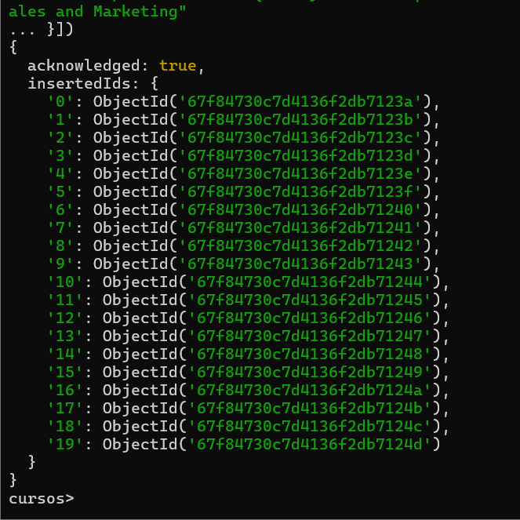
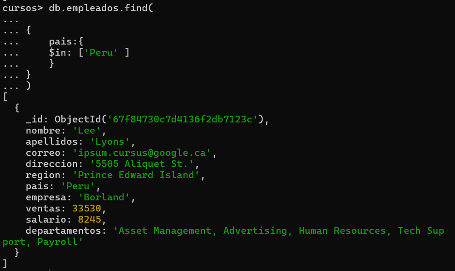
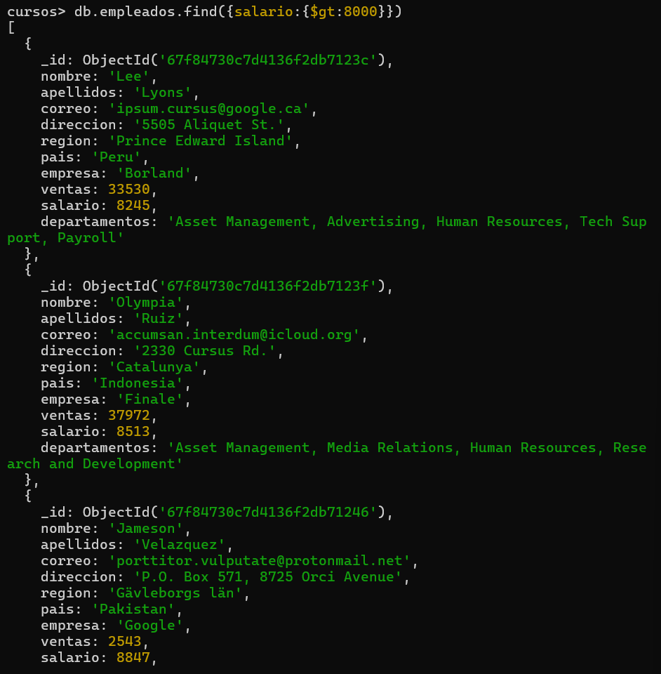
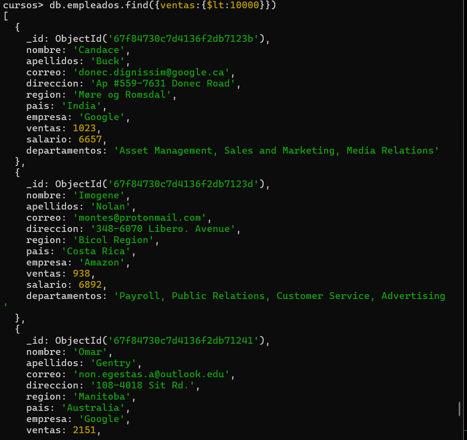
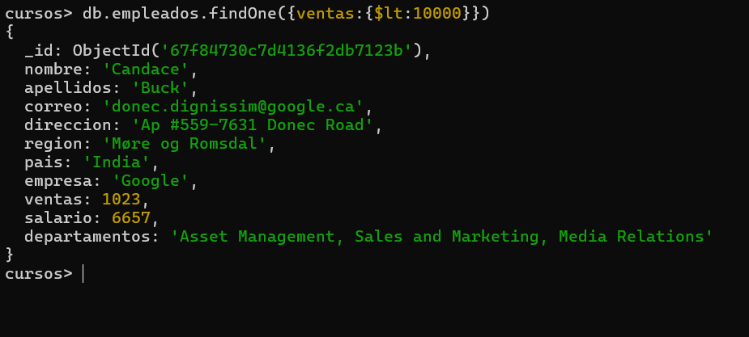
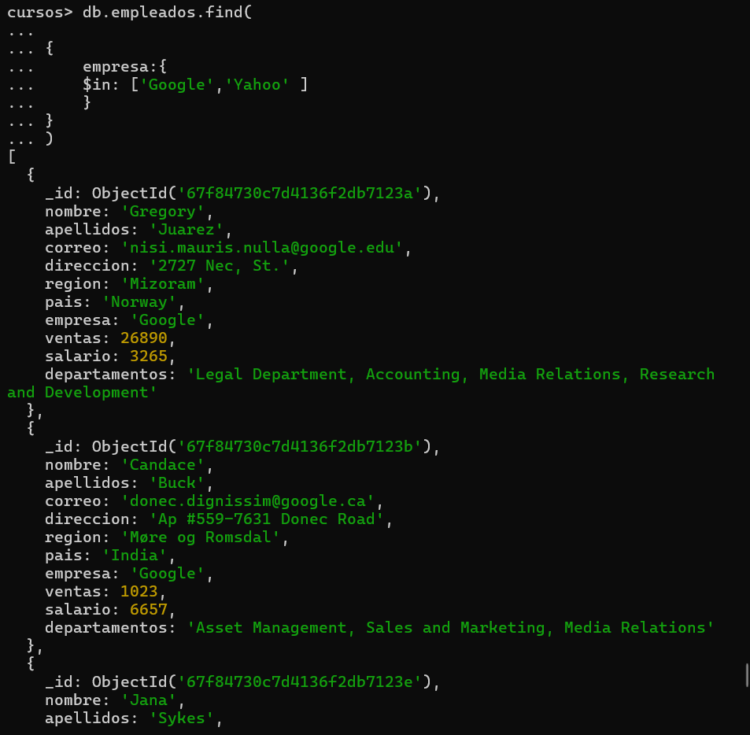
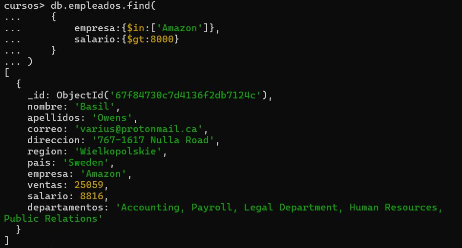
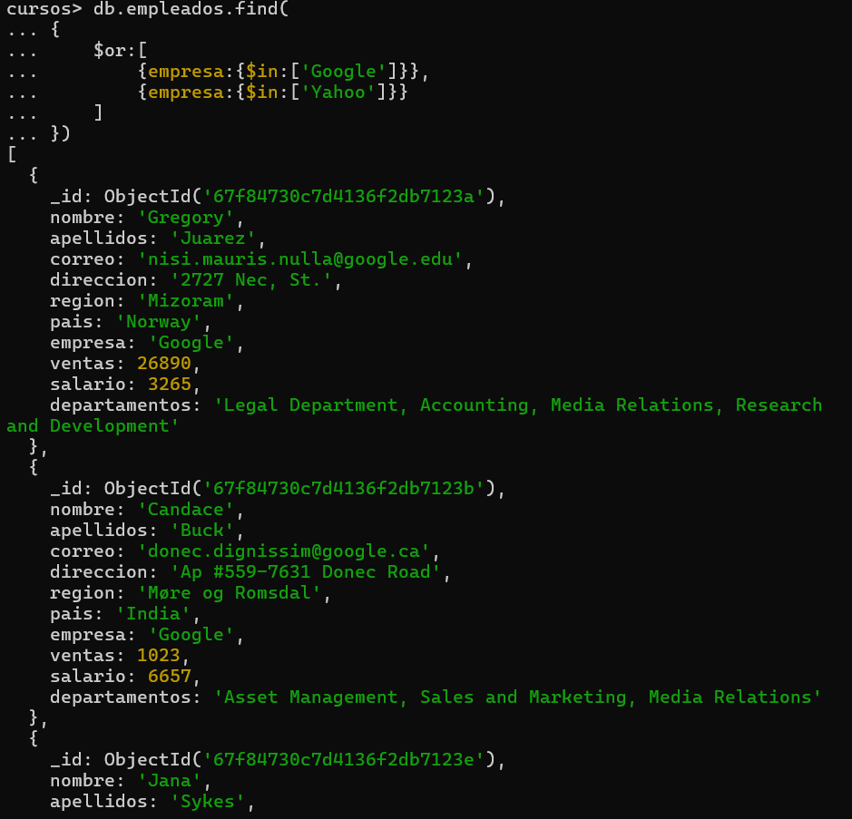
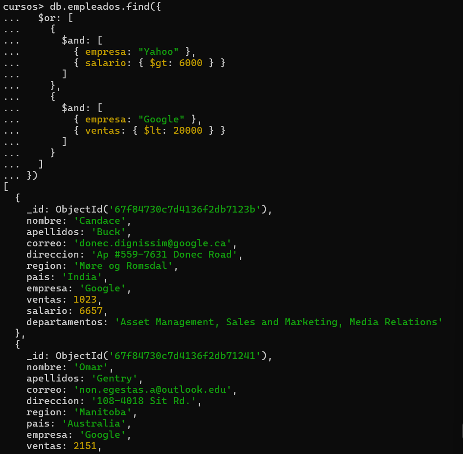
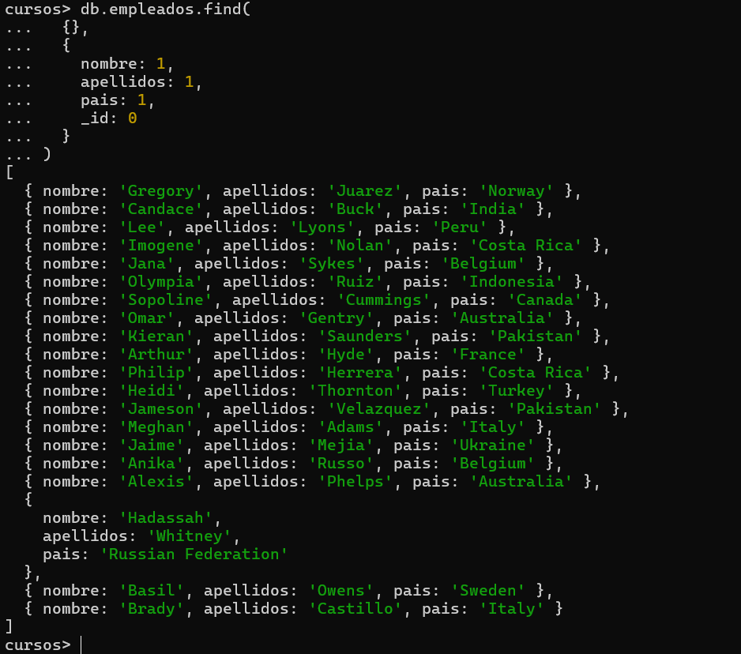

# Consultas

## 1. Cargar el archivo empleados.json


## 2. Utilizar la base de datos curso


## 3. Buscar todos los empleados que trabajen en google
## google
```json
db.empleados.find(

{
    empresa:{
    $in: ['Google' ] 
    }
}
)

[google](../img/2.2.png)
4. Empleados que vivan en peru
db.empleados.find(

{
    pais:{
    $in: ['Peru' ] 
    }
}
)
```

## 5. Empleados que ganen mas de 8000 dolares
## salario
```json
db.empleados.find({salario:{$gt:8000}})
```


## 6. Empleados con ventas inferiores a 10000
## ventas inferiores a 10000
```json
db.empleados.find({ventas:{$lt:10000}})
```


## 7. Realizar la consulta anterior pero devolviendo una sola fila
## la anterior
```json
db.empleados.findOne({ventas:{$lt:10000}})
```


## 8. Empleados que trabajan en google o en yahoo con el operador $in
## Google y Yahoo
```json
db.empleados.find(

{
    empresa:{
    $in: ['Google','Yahoo' ] 
    }
}
)
```


## 9. Empleados de amazon que ganen mas de 8000 dolares

## empleados de amazon
```json
db.empleados.find(
    {
        empresa:{$in:['Amazon']},
        salario:{$gt:8000}
    }
)
```


## 10. Empleados que trabajan en Google o en Yahoo con el operador $or
## or
```json
db.empleados.find(
{
    $or:[
        {empresa:{$in:['Google']}},
        {empresa:{$in:['Yahoo']}}
    ]
})
```



## 11. Empleados que trabajen en Yahoo que ganen mas de 6000 o empleados que trabajen en Google que tengan ventas inferiores a 20000
```json
db.empleados.find({
  $or: [
    {
      $and: [
        { empresa: "Yahoo" },
        { salario: { $gt: 6000 } }
      ]
    },
    {
      $and: [
        { empresa: "Google" },
        { ventas: { $lt: 20000 } }
      ]
    }
  ]
})
```



## 12. Visualizar el nombre, apellidos y el país de cada empleado
```json
db.empleados.find(
  {},
  {
    nombre: 1,
    apellidos: 1,
    pais: 1,
    _id: 0
  }
)
```

