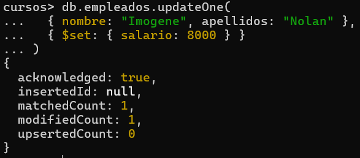
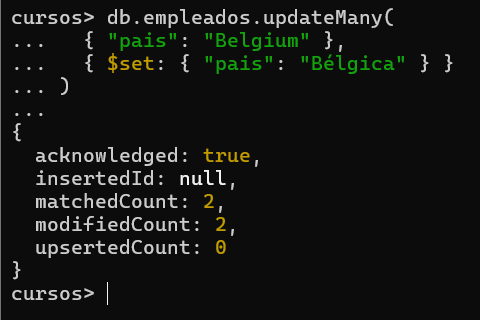

# Practica 3. Updates y Deletes

## 1. Cambiar el salario del empleado Imogene Nolan. Se le asigna 8000.
```json

db.empleados.updateOne(
  { nombre: "Imogene", apellidos: "Nolan" },
  { $set: { salario: 8000 } }
)
```


## 2. Cambiar "Belgium" por "Bélgica" en los empleados (debe haber dos).
```json
db.empleados.updateMany(
  { "pais": "Belgium" }, 
  { $set: { "pais": "Bélgica" } }
)
```



## 4. Reemplazar el empleado Omar Gentry por el siguiente documento:

```json
db.empleados.replaceOne(
{
"nombre": "Omar",
"apellidos": "Gentry",
"correo": "sin correo",
"direccion": "Sin calle",
"region": "Sin region",
"pais": "Sin pais",
"empresa": "Sin empresa",
"ventas": 0,
"salario": 0,
"departamentos": "Este empleado ha sido anulado"
})
```
[](../img/3.4.png)

## 5. Con un find comprobar que el empleado ha sido modificado
```json
db.empleados.find({ "pais": "Bélgica" })
```
[](../img/3.5.png)


## 6. Borrar todos los empleados que ganen mas de 8500. Nota: deben ser borrados 3 documentos
```json
db.empleados.deleteMany({ "salario": { $gt: 8500 } })
```
[](../img/3.6.png)

## 7. Visualizar con una expresión regular todos los empleados con apellidos que comiencen con "R"
```json
db.empleados.find({ "apellidos": { $regex: "^R", $options: "i" } })
```
[](../img/3.7.png)
## 8. Buscar todas las regiones que contenga un "V". Hacerlo con el operador $regex y que no distinga mayúsculas y minúsculas. Deben salir 2.
```json
db.empleados.find({ "region": { $regex: "v", $options: "i" } })
```
[](../img/3.8.png)

## 9. Visualizar los apellidos de los empleados ordenados por el propio apellido.
```json
db.empleados.find(
  {},
  { apellidos: 1, _id: 0 }
).sort({ apellidos: 1 })
```
[](../img/3.9.png)

## 10. Indicar el número de empleados que trabajan en Google.
```json
db.empleados.find(
  {},
  { apellidos: 1, _id: 0 }
).sort({ apellidos: 1 })
```
[](../img/3.10.png)
## 11. Borrar la colección empleados y la base de datos
```json
db.empleados.drop()
```
[](../img/3.11.1.png)
```json
db.dropDatabase()
```
[](../img/3.11.2.png)

